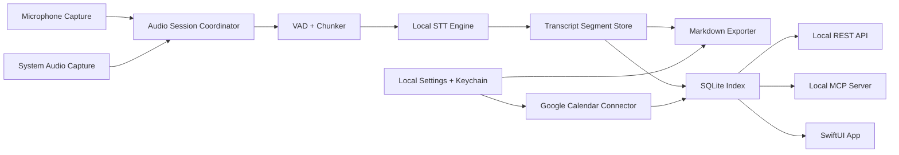

# Architecture

## System Shape

Meeting007 is a native macOS application with a local processing pipeline and local access services.



## Native App

- Swift and SwiftUI provide the macOS app shell.
- ScreenCaptureKit captures system audio.
- AVAudioEngine/CoreAudio captures microphone audio.
- A Google Calendar connector provides meeting context after explicit user connection.
- Later convenience layers may add global hotkeys for quick start/stop and copy actions.
- Later convenience layers may add menu bar controls for essential recording state and copy actions.

## Audio Capture

The capture layer keeps audio lanes separate:

- `mic`: local microphone, displayed as `Me`.
- `system`: remote speakers and meeting app audio, displayed as `Others`.

The app should avoid mixing these lanes before transcription unless a fallback path requires it. Keeping lanes separate improves attribution and preserves future diarization options.

Current implemented microphone boundary:

- `RecordingCaptureDriver` remains the Start/Stop lifecycle boundary used by the app.
- `MicrophoneRecordingCaptureDriver` composes a microphone driver with a runtime-only audio chunk consumer.
- `CapturedAudioChunk` carries meeting ID, lane, timing, sample rate, channel count, and byte count metadata for future local STT.
- `RuntimeOnlyAudioChunkConsumer` accepts chunks only while the session is active and clears them on Stop.
- `AVAudioEngineMicrophoneCaptureDriver` lives in the macOS app edge, requests microphone access on Start, starts `AVAudioEngine`, emits in-memory mic chunk metadata, and updates the UI with a compact mic lane status.
- The first mic slice does not persist raw audio, does not transcribe real audio, and does not add system audio capture.

## Transcription Pipeline

The STT engine is behind a protocol boundary:

- Input: timestamped audio chunks with lane metadata.
- Output: partial and final transcript segments.
- Default language: Russian.
- Default execution: local Apple Silicon acceleration through a Whisper-family runtime.

The chunker uses VAD to cut speech at natural boundaries. Partial segments may update. Final segments are immutable except for explicit correction/finalization passes.

## Storage

Meeting data has two local forms:

- Markdown files are the durable user-owned transcript format.
- SQLite is the indexed operational store for search, segment retrieval, API responses, and live state.

Current implemented storage boundary:

- `TranscriptFileWriting` is the protocol for durable transcript file persistence.
- `LocalMarkdownTranscriptFileWriter` is the default writer used by the app after Stop.
- `MarkdownTranscriptFileStore` owns folder creation, filename generation, Markdown file writing, and temp-file cleanup.
- Default Markdown folder: `~/Documents/Meeting007/Transcripts/`.
- Markdown export uses a same-folder temp file and then moves/replaces the final Markdown file.
- Markdown files are durable user-owned artifacts; the in-memory recent-recording store remains runtime-only.
- SQLite remains a later storage-index slice and must not be introduced implicitly by Markdown export work.

Planned configurable storage boundary:

- The default Markdown folder remains `~/Documents/Meeting007/Transcripts/`.
- The user can choose a different local folder for future Markdown exports.
- The selected folder is local app configuration stored in app preferences and must not create a cloud dependency.
- Folder selection must use a native macOS folder picker and validate write access before becoming active.
- Existing Markdown transcripts are not moved when the setting changes unless a future explicit migration flow is designed.
- If the selected folder is missing or not writable, export should fail recoverably: keep the transcript visible, explain the impact, and offer retry/change-folder actions.

Current implemented configurable storage boundary:

- `MarkdownTranscriptFolderSettings` owns default-folder resolution, selected-folder persistence, reset-to-default behavior, and write validation.
- Write validation creates the selected folder if needed, writes a temporary probe file, and removes it.
- `RecordingShellViewModel` rebuilds `LocalMarkdownTranscriptFileWriter` when the selected folder changes so future exports use the new folder.
- The app stores a filesystem path only. Sandboxed production builds may require security-scoped bookmarks before distribution.

Planned Markdown migration boundary:

- Migration is a separate module from folder selection and Markdown export.
- Migration must preview source files, destination files, conflicts, and expected actions before writing.
- Migration must copy/write each destination file and verify it before removing the source file.
- Migration must avoid silent overwrites and produce a local result report.
- SQLite index reconciliation belongs to the future storage-index slice and must be designed before migration updates indexed paths.

Meeting IDs are UUIDs. Current Markdown filenames use UTC start time, transliterated title slug, and short UUID:

```text
2026-06-08_14-30_russkaya-vstrecha_a1b2c3d4.md
```

The Markdown file preserves the original meeting title, including Cyrillic text, in front matter and the H1.

## Calendar Context

Google Calendar integration is optional and must not replace manual recording.

MVP connector responsibilities:

- Run only after explicit user connection.
- Request the minimum Google Calendar access needed for event title/topic, time, and participants.
- Store OAuth refresh/access credentials in Keychain.
- Fetch current/upcoming event metadata and map it into local meeting metadata.
- Use event title/topic as the suggested meeting title.
- Store participant names/emails as local meeting metadata, subject to privacy review before API/MCP exposure.

Enhancement responsibilities:

- Show today's meetings on the main screen.
- Let the user start recording from a selected meeting.
- Schedule macOS Notification Center reminders before meeting start after notification permission.

Calendar data must not be sent to any hosted Meeting007 backend in v1.

## Local REST API

The local REST API is localhost-only by default.

Initial endpoints:

- `GET /v1/meetings`
- `GET /v1/meetings/{id}`
- `GET /v1/meetings/{id}/transcript`
- `GET /v1/meetings/{id}/segments`
- `GET /v1/search?q=...`

All endpoints read from the SQLite index and return data that matches the Markdown transcript source.

## MCP Server

The local MCP server mirrors the REST access model for AI assistants.

Initial tools:

- `list_recent_meetings`
- `search_meetings`
- `get_meeting`
- `get_transcript`

The MCP server must not expose audio files by default.

## Security Boundary

- REST and MCP bind to localhost.
- API tokens are stored in Keychain.
- The app must provide an explicit control for enabling or disabling local access services.
- No cloud path may be introduced without a new ADR and user-facing product decision.
