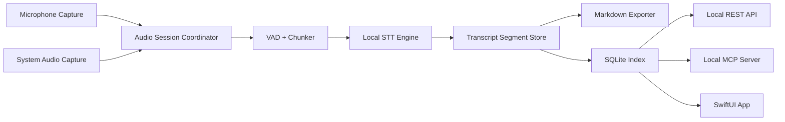

# Architecture

## System Shape

Meeting007 is a native macOS application with a local processing pipeline and local access services.



## Native App

- Swift and SwiftUI provide the macOS app shell.
- ScreenCaptureKit captures system audio.
- AVAudioEngine/CoreAudio captures microphone audio.
- EventKit provides calendar access after user consent.
- Later convenience layers may add global hotkeys for quick start/stop and copy actions.
- Later convenience layers may add menu bar controls for essential recording state and copy actions.

## Audio Capture

The capture layer keeps audio lanes separate:

- `mic`: local microphone, displayed as `Me`.
- `system`: remote speakers and meeting app audio, displayed as `Others`.

The app should avoid mixing these lanes before transcription unless a fallback path requires it. Keeping lanes separate improves attribution and preserves future diarization options.

## Transcription Pipeline

The STT engine is behind a protocol boundary:

- Input: timestamped audio chunks with lane metadata.
- Output: partial and final transcript segments.
- Default language: Russian.
- Default execution: local Apple Silicon acceleration through a Whisper-family runtime.

The chunker uses VAD to cut speech at natural boundaries. Partial segments may update. Final segments are immutable except for explicit correction/finalization passes.

## Storage

Meeting data has two local forms:

- Markdown files are the durable user-owned transcript format.
- SQLite is the indexed operational store for search, segment retrieval, API responses, and live state.

Meeting IDs are UUIDs. Filenames should use date plus readable meeting title slug, for example:

```text
2026-06-07_product-sync.md
```

## Local REST API

The local REST API is localhost-only by default.

Initial endpoints:

- `GET /v1/meetings`
- `GET /v1/meetings/{id}`
- `GET /v1/meetings/{id}/transcript`
- `GET /v1/meetings/{id}/segments`
- `GET /v1/search?q=...`

All endpoints read from the SQLite index and return data that matches the Markdown transcript source.

## MCP Server

The local MCP server mirrors the REST access model for AI assistants.

Initial tools:

- `list_recent_meetings`
- `search_meetings`
- `get_meeting`
- `get_transcript`

The MCP server must not expose audio files by default.

## Security Boundary

- REST and MCP bind to localhost.
- API tokens are stored in Keychain.
- The app must provide an explicit control for enabling or disabling local access services.
- No cloud path may be introduced without a new ADR and user-facing product decision.
