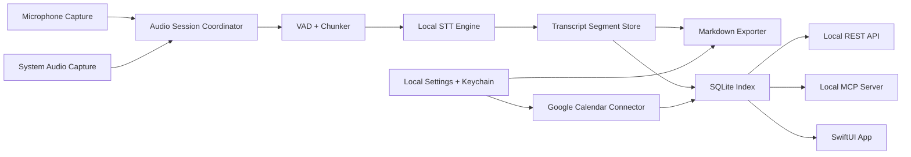

# Architecture

## System Shape

Meeting007 is a native macOS application with a local processing pipeline and local access services.



## Native App

- Swift and SwiftUI provide the macOS app shell.
- ScreenCaptureKit captures system audio.
- AVAudioEngine/CoreAudio captures microphone audio.
- A Google Calendar connector provides meeting context after explicit user connection.
- Later convenience layers may add global hotkeys for quick start/stop and copy actions.
- Later convenience layers may add menu bar controls for essential recording state and copy actions.

## Audio Capture

The capture layer keeps audio lanes separate:

- `mic`: local microphone, displayed as `Me`.
- `system`: remote speakers and meeting app audio, displayed as `Others`.

The app should avoid mixing these lanes before transcription unless a fallback path requires it. Keeping lanes separate improves attribution and preserves future diarization options.

Current implemented microphone boundary:

- `RecordingCaptureDriver` remains the Start/Stop lifecycle boundary used by the app.
- `MicrophoneRecordingCaptureDriver` composes a microphone driver with a capture-session consumer.
- `CapturedAudioChunk` carries meeting ID, lane, sample-clock timing, byte count, normalized sample format, and in-memory Float PCM samples.
- `RuntimeAudioFrameNormalizer` downmixes microphone input to mono and resamples it to 16 kHz for the VAD/STT path.
- `RuntimeOnlyAudioChunkConsumer` accepts sample-bearing chunks only while the session is active, forwards active mic PCM to the rolling live transcription path, feeds VAD for legacy speech-chunk consumers, drains queued speech delivery on Stop, and clears PCM buffers on Stop.
- `VADSpeechChunker` turns speech-positive PCM frames into bounded `SpeechChunk` utterances and flushes active speech on Stop so the last spoken words are not dropped.
- `AVAudioEngineMicrophoneCaptureDriver` lives in the macOS app edge, requests microphone access on Start, starts `AVAudioEngine`, emits ordered in-memory sample-bearing mic chunks through one delivery tail, derives timestamps from emitted sample count, and updates the UI with a compact mic lane status.
- `LossResistantCaptureSession` writes each accepted chunk to the local spool before enqueueing it for the live runtime consumer. Closing it drains capture writes and closes the spool without waiting for live STT shutdown.
- `LocalCaptureSessionSpool` stores per-lane append-only Float PCM and ordered JSONL metadata under app-owned Application Support. Closed sessions remain readable until explicit cleanup.
- `CaptureLatencyMarkers` records only local in-memory lifecycle event, session ID, and monotonic timestamp values.
- System audio capture is not part of the current slice; the spool metadata and lane files already preserve the lane boundary.

Implemented loss-resistant capture foundation:

- `RecordingCaptureDriver` remains the user-facing Start/Stop boundary; Start creates the local capture session before microphone delivery begins.
- The local capture session spool is the durable source of truth for captured transcription input during an active meeting.
- Each audio chunk in the spool must carry meeting ID, lane, sequence number, sample-start, sample-end, sample rate, channel count, byte count, and local capture timing.
- The spool may retain raw audio only as temporary local data needed to prevent transcript loss before finalization, following [ADR 0002](adr/0002-temporary-local-audio-spool.md).
- The spool must not be exposed through Markdown, SQLite transcript records, REST, MCP, logs, telemetry, or cloud services.
- Successful final transcript completion deletes the temporary spool only after Markdown is written locally. Finalization, Markdown, or model failure preserves the closed spool for recovery.

## Transcription Pipeline

The STT engine is behind a protocol boundary:

- Input: VAD-bounded `SpeechChunk` utterances with lane metadata and normalized in-memory PCM samples.
- Output: partial and final transcript segments.
- Default language: Russian.
- Default execution: local Apple Silicon acceleration through a Whisper-family runtime.

The chunker uses VAD to cut speech at natural boundaries. Partial segments may update. Final segments are immutable except for explicit correction/finalization passes.

Target transcription architecture:

- Live transcription and final transcript reconciliation are separate local workers.
- The live worker consumes ordered frames from the capture session spool or a low-latency frame stream and emits draft `partial` segments quickly.
- The finalizer streams the complete closed local spool in bounded non-overlapping audio windows after Stop and emits final segments keyed by audio offsets. It does not load the whole meeting into memory or derive final text from rolling partial strings.
- Stop must stop capture promptly and must not block indefinitely on the finalizer.
- Segment reconciliation must use lane and sample offsets rather than UI string-prefix matching.
- A single heavy rolling Whisper decode must not be responsible for live draft text, stable committed text, and final transcript quality at the same time.
- If the finalizer fails or exceeds its deadline, the app must preserve the local spool and show a recoverable finalization state instead of losing captured speech.
- Development/QA instrumentation should record local-only latency markers for Start, first audio frame, live worker readiness, first partial, Stop, capture stopped, finalization start, and finalization completion/failure.

Current implemented STT boundary:

- `STTSessionConfig` defaults transcription to Russian (`ru`) and the microphone lane.
- `LocalSTTPipeline` owns the legacy speech-window lifecycle, accepts `SpeechChunk` utterances, upserts partial/final `TranscriptSegment` updates, ignores chunks after Stop, and exposes visible segments for UI/copy/export.
- `SpeechTranscribing` is the runtime protocol that real WhisperKit or another local STT adapter will implement.
- `FakeRussianSpeechTranscriber` provides deterministic Russian partial/final segments for CI-safe checks and UI wiring without cloud or model files.
- `WhisperModelPolicy.defaultRussian` pins `large-v3-v20240930_626MB` as the production Russian model candidate and keeps `tiny` debug-only.
- `LocalSTTModelManaging` owns model readiness checks without downloading or uploading anything.
- `LocalSTTModelPathProviding` extends readiness with a verified local model directory. A caller receives a usable path only after the same local `install.json`, required-file, size, and SHA-256 checks pass.
- `ModelManagedSpeechTranscriber` blocks transcription when the pinned model is missing, invalid, downloading, or failed, and passes through to the current transcriber only when the model is ready.
- `Meeting007WhisperKit` is an isolated adapter target that depends on the upstream `argmax-oss-swift` Swift package product `WhisperKit` while keeping `Meeting007Core` dependency-light and fast to test.
- `WhisperKitSpeechTranscriber` compiles behind the same `SpeechTranscribing` protocol and accepts `SpeechChunk` input only; it does not know about `AVAudioEngine`, VAD internals, Markdown, SQLite, REST, or MCP.
- The WhisperKit adapter defaults to Russian, requires model readiness before transcribing, and deliberately does not initiate automatic model download.
- The app production composition uses `WhisperKitTranscriptionPipelineFactory.makeProductionRollingPipeline` with `LocalSTTModelStore` as the verified model path provider. Active recording feeds normalized mic PCM into a single-flight rolling preview worker. Timer signals are coalesced, decode runs only after audio advances, and the UI exposes one stable-ID partial row instead of simultaneous stale final and partial rows.
- When the verified Russian model is ready, the app asks the rolling pipeline to prewarm the local WhisperKit runtime after readiness refresh or successful model installation. Prewarm verifies the same local model directory, creates no microphone session, starts no recording, performs no automatic download, and uses only local model files.
- When a recording starts, microphone capture begins before local STT readiness is required. After the rolling pipeline reports ready, the app replays already captured in-memory runtime chunks into the rolling buffer so the first seconds of speech are less likely to be lost. The rolling pipeline rejects already accepted chunks by sample-clock end time to keep replay from creating duplicate live text.
- `RollingLocalTranscriptionPipeline` owns the active preview lifecycle, serializes decode calls, coalesces ticks, ignores duplicate replay chunks, and clears a transient current failure after a successful retry. On Stop, `SpoolTranscriptFinalizer` sequentially decodes the complete recovered spool into non-overlapping offset-based final segments. The rolling preview is only a fallback when full-spool finalization fails.
- The production rolling WhisperKit adapter keeps the prepared local engine warm across normal recording Stop so the next Start avoids rebuilding the runtime. Explicit warm-engine release remains a future idle-time/memory-pressure policy; normal Stop still clears Meeting007 rolling session state and runtime PCM buffers.
- Runtime WhisperKit load/decode errors are exposed through the STT pipeline failure state so the app can switch from `Transcribing locally` to a recoverable unavailable status instead of silently showing an empty transcript.
- `LocalSTTModelInstaller` owns explicit-consent install lifecycle separately from transcription: pending consent, progress, verification, ready, cancellation, and failure.
- `LocalSTTModelStore` checks the app-owned model folder under Application Support and exposes readiness through `LocalSTTModelManaging`; model files are never stored in the Markdown transcript folder.
- `HuggingFaceModelDownloader` is the production installer boundary for the current Russian model. It lists files from `argmaxinc/whisperkit-coreml`, pins the `openai_whisper-large-v3-v20240930_626MB` folder at revision `7235bbd`, downloads files into an app-owned `.staging/<requestID>/` folder, verifies required CoreML/config entries, computes local SHA-256 for every file, compares HuggingFace LFS SHA-256 when available, then promotes the verified folder into the final model path.
- `install.json` is written only after successful verification and records policy ID, language, repository, revision, folder, actual bytes, file count, per-file sizes, per-file SHA-256, `source: explicit-user-consent`, and `status: installed`.
- The verified model folder must include WhisperKit tokenizer runtime files (`tokenizer.json` and `tokenizer_config.json`) in addition to the CoreML model bundles. CoreML-only installs are not ready because WhisperKit cannot decode text without the tokenizer.
- Existing installs are considered ready only when `install.json` matches the current Russian policy and all recorded files still exist with matching sizes and SHA-256 values. A folder without a valid marker, tokenizer files, or with corrupted files is not ready and does not trigger automatic repair.
- The app Settings surface shows Russian model status and starts install only after a confirmation sheet. Real WhisperKit rolling transcription remains a transitional live preview; the full-spool finalizer is the authoritative Stop result. System-audio transcription, a dedicated final model, recovery UI, and latency tuning remain future slices.

## Storage

Meeting data has two local forms:

- Markdown files are the durable user-owned transcript format.
- SQLite is the indexed operational store for search, segment retrieval, API responses, and live state.

Current implemented storage boundary:

- `TranscriptFileWriting` is the protocol for durable transcript file persistence.
- `LocalMarkdownTranscriptFileWriter` is the default writer used by the app after Stop.
- `MarkdownTranscriptFileStore` owns folder creation, filename generation, Markdown file writing, and temp-file cleanup.
- Default Markdown folder: `~/Documents/Meeting007/Transcripts/`.
- Markdown export uses a same-folder temp file and then moves/replaces the final Markdown file.
- Markdown files are durable user-owned artifacts; the in-memory recent-recording store remains runtime-only.
- SQLite remains a later storage-index slice and must not be introduced implicitly by Markdown export work.

Planned configurable storage boundary:

- The default Markdown folder remains `~/Documents/Meeting007/Transcripts/`.
- The user can choose a different local folder for future Markdown exports.
- The selected folder is local app configuration stored in app preferences and must not create a cloud dependency.
- Folder selection must use a native macOS folder picker and validate write access before becoming active.
- Existing Markdown transcripts are not moved when the setting changes unless a future explicit migration flow is designed.
- If the selected folder is missing or not writable, export should fail recoverably: keep the transcript visible, explain the impact, and offer retry/change-folder actions.

Current implemented configurable storage boundary:

- `MarkdownTranscriptFolderSettings` owns default-folder resolution, selected-folder persistence, reset-to-default behavior, and write validation.
- Write validation creates the selected folder if needed, writes a temporary probe file, and removes it.
- `RecordingShellViewModel` rebuilds `LocalMarkdownTranscriptFileWriter` when the selected folder changes so future exports use the new folder.
- The app stores a filesystem path only. Sandboxed production builds may require security-scoped bookmarks before distribution.

Planned Markdown migration boundary:

- Migration is a separate module from folder selection and Markdown export.
- Migration must preview source files, destination files, conflicts, and expected actions before writing.
- Migration must copy/write each destination file and verify it before removing the source file.
- Migration must avoid silent overwrites and produce a local result report.
- SQLite index reconciliation belongs to the future storage-index slice and must be designed before migration updates indexed paths.

Meeting IDs are UUIDs. Current Markdown filenames use UTC start time, transliterated title slug, and short UUID:

```text
2026-06-08_14-30_russkaya-vstrecha_a1b2c3d4.md
```

The Markdown file preserves the original meeting title, including Cyrillic text, in front matter and the H1.

## Calendar Context

Google Calendar integration is optional and must not replace manual recording.

MVP connector responsibilities:

- Run only after explicit user connection.
- Request the minimum Google Calendar access needed for event title/topic, time, and participants.
- Store OAuth refresh/access credentials in Keychain.
- Fetch current/upcoming event metadata and map it into local meeting metadata.
- Use event title/topic as the suggested meeting title.
- Store participant names/emails as local meeting metadata, subject to privacy review before API/MCP exposure.

Enhancement responsibilities:

- Show today's meetings on the main screen.
- Let the user start recording from a selected meeting.
- Schedule macOS Notification Center reminders before meeting start after notification permission.

Calendar data must not be sent to any hosted Meeting007 backend in v1.

## Local REST API

The local REST API is localhost-only by default.

Initial endpoints:

- `GET /v1/meetings`
- `GET /v1/meetings/{id}`
- `GET /v1/meetings/{id}/transcript`
- `GET /v1/meetings/{id}/segments`
- `GET /v1/search?q=...`

All endpoints read from the SQLite index and return data that matches the Markdown transcript source.

## MCP Server

The local MCP server mirrors the REST access model for AI assistants.

Initial tools:

- `list_recent_meetings`
- `search_meetings`
- `get_meeting`
- `get_transcript`

The MCP server must not expose audio files by default.

## Security Boundary

- REST and MCP bind to localhost.
- API tokens are stored in Keychain.
- The app must provide an explicit control for enabling or disabling local access services.
- No cloud path may be introduced without a new ADR and user-facing product decision.
