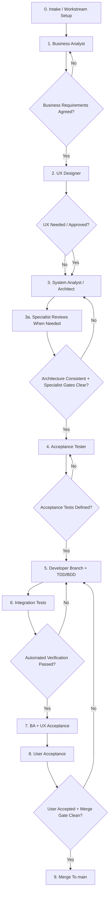

# Agent Workflow

This workflow defines how Meeting007 work moves from business intent to `main`. It is designed for parallel AI-assisted development while keeping product decisions, architecture, tests, and user acceptance visible.

## Recommended Flow

The user's proposed flow is strong. The improvement is to add an explicit intake step and a release-captain gate before merge. That keeps parallel work coordinated and prevents branches from reaching `main` with missing documentation, tests, or acceptance.

## Mandatory Subagent Rule

Codex must use the specialized subagents for repository work instead of self-approving role gates.

Required behavior:

- Before implementation, spawn or message the relevant role subagents for the workstream.
- Do not start coding until BA requirements, UX impact when relevant, architecture impact, and acceptance scenarios are available.
- Code-changing work always requires a Developer subagent in addition to BA/UX/Architecture/QA gates.
- UI-affecting work always requires UX Designer and Acceptance/QA subagents.
- Storage, privacy, API/MCP, audio, STT, performance, CI/build, or documentation-sensitive work requires the matching specialist subagent listed in this workflow.
- If subagent tooling is unavailable, mark the workstream blocked and ask the user whether to proceed without the required gate.
- Record subagent outputs or a concise summary of them in `docs/workstreams.md`, `docs/design/*`, `docs/product/*`, or the PR notes before user acceptance.
- If implementation diverges from a subagent recommendation, document the product reason and get user acceptance before merge.

Gate:

- A branch is not ready for user acceptance when required subagent review is missing, stale, or contradicted by the implementation.

## 0. Intake / Workstream Setup

Purpose: create a shared work container before roles start working.

Required outputs:

- Workstream entry in `docs/workstreams.md`.
- User outcome stated in business language.
- Scope and out-of-scope.
- Target backlog priority from `docs/product/prioritized-backlog.md`.
- Owner/agent roles assigned.
- Required subagents listed by role, with status: pending, complete, skipped with reason, or blocked.

Gate:

- Work does not start until the user outcome and expected acceptance path are clear.
- Work does not start until required subagent roles are either completed or explicitly marked blocked/skipped with a documented user-approved reason.

## 1. Business Analyst

Purpose: clarify what the user needs and convert it into business-level backlog detail.

Required outputs:

- Updated business requirements or user steps.
- Acceptance criteria in user-visible language.
- Open product decisions documented.
- Dependencies and priority confirmed.

Gate:

- No architecture or coding starts until the affected user workflow and acceptance criteria are explicit.

Communication rule:

- Ask about user outcomes, workflow, privacy, reliability, and acceptance. Avoid raw technical questions unless translated into user experience impact.

## 2. UX Designer

Purpose: make user-facing work convenient, calm, fast, trustworthy, and visually excellent before architecture and development harden the experience. The UX role is accountable for product design quality, not just button placement.

Use this role when the change affects:

- First launch, setup, permissions, recording screen, transcript view, meeting history, settings, error/recovery UX, copy controls, menu bar, hotkeys, API/MCP enablement screens, or user acceptance instructions.

Required outputs:

- User flow in business language.
- Screen/state inventory: empty, loading, active, success, error, blocked, permission-denied.
- Interaction model: primary action, secondary actions, hotkeys/menu bar behavior when relevant.
- Information architecture: left navigation, main work surface, details/inspector, toolbar, context menus, settings, and system surfaces.
- Native macOS behavior: focus, Enter/Escape behavior, context menus, file reveal/copy path behavior, copy/paste, and keyboard expectations.
- Visual hierarchy and layout rationale.
- `docs/design-quality-gate.md` pass/fail review.
- Liquid Glass/material plan following Apple's current Human Interface Guidelines, including transparency/contrast/motion fallbacks.
- UX acceptance criteria.
- Copy/microcopy for sensitive moments such as permissions, local-only privacy, recording state, and errors.
- Accessibility and keyboard expectations.
- Visual constraints for developer implementation.
- Quality-bar review: explicit notes on why the design will not feel like a student prototype, web form, or random button collection.

Gate:

- UI-affecting development does not start until the target experience, states, and acceptance criteria are documented.
- UI-affecting development does not start until a UX Designer subagent has reviewed the target experience and its output is captured in the workstream or design docs.
- Backend-only work may skip UX design, but the workstream must explicitly say UX is not affected.
- UI-affecting development does not start if the same concept is editable in multiple places without a deliberate design reason.
- UI-affecting development does not start if row-specific actions are placed as global buttons without evaluating context menus or native row actions.

Design rule:

- Meeting007 is a work surface, not a marketing site. Optimize for clarity, repeated use, low meeting-time friction, and confidence that data stays local.
- Meeting007 should feel like a premium native macOS productivity app. Optimize for composed layout, clear hierarchy, context-aware actions, high information density, and native interaction behavior.
- When designing visible macOS surfaces, apply Apple's Liquid Glass direction where it supports hierarchy and native feel, while preserving transcript readability and accessibility.
- If the designer would not be proud to show the screen as a polished shipping product, the workstream returns to UX before development.

## 3. System Analyst / Architect

Purpose: translate agreed business requirements into technical and architectural requirements.

Required outputs:

- Architecture changes or confirmation that existing architecture covers the work.
- Data flow, interfaces, module boundaries, and failure modes.
- Privacy/security impact.
- ADR for significant decisions.
- Technical acceptance criteria for implementation.

Gate:

- No coding starts until architecture impact is documented and consistent with local-first constraints.

## 3a. Specialist Reviews When Needed

Purpose: reduce the highest product risks before acceptance tests and implementation start.

Use specialist agents when a workstream touches their risk area:

- macOS Audio/Capture Specialist: microphone capture, system audio, ScreenCaptureKit, permissions, latency, Zoom/Meet/Teams/Slack behavior.
- Local STT / ML Engineer: local Russian transcription, VAD, partial/final segments, model installation, Apple Silicon performance.
- Security & Privacy Reviewer: local-only behavior, tokens, logs, raw audio/transcript handling, REST/MCP exposure.
- QA Automation Engineer: test harnesses, fixtures, BDD automation, deterministic fake audio/transcript flows.
- CI / Build Engineer: branch protection, CI commands, build reproducibility, release packaging, notarization planning.
- Performance Reviewer: latency, CPU/RAM/battery, UI responsiveness during recording/transcription.
- Technical Writer / Docs Keeper: documentation completeness, handoff clarity, user acceptance instructions.
- Dogfood / User Research Agent: real personal workflow checks and post-acceptance friction notes.

Required outputs:

- Specialist risk assessment.
- Required tests or manual QA.
- Go/no-go recommendation.
- Documentation or ADR requirements.

Gate:

- If a specialist marks a blocking risk, the workstream cannot proceed to development until the risk is resolved or explicitly deferred outside `main`.

## 4. Acceptance Tester

Purpose: define high-level acceptance tests before implementation.

Required outputs:

- Acceptance scenarios in business-readable Given/When/Then form.
- Manual QA checklist updates when the change affects UX, permissions, capture, API, MCP, storage, or privacy.
- Automated test expectations for the developer.

Gate:

- Developer does not start implementation until top-level acceptance scenarios exist.
- Developer does not start implementation until an Acceptance Tester or QA subagent has produced a checklist or Given/When/Then scenarios for the workstream.

## 5. Developer Branch + TDD/BDD

Purpose: implement the smallest safe increment on a branch.

Rules:

- Create a feature branch before code changes.
- Use the Developer subagent for code-changing work. The main Codex agent may integrate and review, but must not self-approve the developer gate.
- Use TDD/BDD: write or update checks that express expected behavior before or alongside implementation.
- Preferred order is red-green-refactor: add or update a failing/meaningful check, implement the smallest change, run the check, then refactor if needed.
- For UI-only changes where no automated UI harness exists yet, write acceptance scenarios and manual QA steps before implementation, document the missing automation, and keep the gap visible in the workstream.
- Keep changes scoped to the approved workstream.
- Do not merge untested work into `main`.
- Do not revert unrelated user or agent changes.

Required outputs:

- Code changes.
- Automated checks and explicit TDD/BDD evidence.
- Updated docs.
- Branch notes in `docs/workstreams.md`.
- Developer subagent summary: what files changed, what tests/checks were added or updated, and what gaps remain.

Gate:

- Branch is not ready until local verification passes or missing test infrastructure is documented and the work is explicitly marked not ready for `main`.
- Branch is not ready until the Developer subagent gate is complete and summarized.

## 6. Integration Tests

Purpose: prove changed parts work together.

Required checks:

- Existing verification command, currently `swift run Meeting007CoreChecks`.
- Integration tests relevant to the workstream.
- Manual QA where automation is not enough.

For Meeting007, integration testing should eventually cover:

- Capture lane to transcript segment.
- Segment to Markdown and SQLite.
- SQLite to app view, REST, and MCP.
- Permission denial and recovery.
- Local-only behavior.

Gate:

- Integration failures return the branch to the developer.

## 7. Business Analyst + UX Acceptance

Purpose: confirm the delivered behavior still matches the agreed business requirement.

Required outputs:

- BA acceptance note in PR or workstream.
- UX acceptance note when the change affects visible user experience.
- Confirmation that acceptance criteria are met or list of gaps.
- Confirmation that documentation matches delivered behavior.
- UX confirmation that implemented placement, focus behavior, keyboard behavior, context menus, spacing, and visual hierarchy match the approved design standard.

Gate:

- User acceptance is not requested until BA acceptance is complete and UX acceptance is complete for user-facing changes.
- User acceptance is not requested until required subagent findings are reflected in implementation or documented as deliberately deferred.
- User acceptance is not requested for visible UI if the UX reviewer sees avoidable amateur patterns, duplicated controls, misplaced actions, or non-native macOS behavior.

## 8. User Acceptance

Purpose: let the user make the final product decision before merge.

Required user-facing instructions:

- Where to look: files, screen, app area, API endpoint, or output artifact.
- What to check: exact user workflow and expected result.
- How to run: commands, app launch steps, or manual QA steps.
- What is not included: explicit scope boundaries for this increment.
- Known risks or limitations.

Allowed outcomes:

- `Accepted`: can merge to `main`.
- `Accepted with Follow-ups`: can merge; follow-ups become backlog items.
- `Rejected`: cannot merge; return to developer.
- `Blocked`: cannot merge until the environment, instructions, build, permissions, or hardware blocker is resolved.

Gate:

- Branch cannot merge until the user explicitly accepts the result or explicitly delegates acceptance.

## 9. Release Captain / Merge To main

Purpose: protect `main`.

Required before merge:

- User acceptance received.
- Automated verification passed.
- Required manual QA completed or marked not required.
- BA acceptance completed.
- UX acceptance completed or marked not applicable.
- Business and architecture docs updated.
- Workstream updated.
- PR checklist complete.
- No private audio, transcripts, local databases, tokens, model files, or build outputs committed.

Merge rule:

- `main` contains only accepted, tested, documented increments.

Final response rule:

- After an accepted workstream is merged and verified on `main`, the user-facing closeout must include the top 3 next backlog options.
- Each option should be phrased as a user outcome, not a technical task.
- Include the recommended next option when one is clearly the best product path.

## Role Files

Reusable role prompts live in `docs/agents/`:

- `docs/agents/business-analyst.md`
- `docs/agents/ux-designer.md`
- `docs/agents/system-architect.md`
- `docs/agents/macos-audio-specialist.md`
- `docs/agents/local-stt-engineer.md`
- `docs/agents/security-privacy-reviewer.md`
- `docs/agents/qa-automation-engineer.md`
- `docs/agents/ci-build-engineer.md`
- `docs/agents/performance-reviewer.md`
- `docs/agents/technical-writer.md`
- `docs/agents/dogfood-user-researcher.md`
- `docs/agents/acceptance-tester.md`
- `docs/agents/developer.md`
- `docs/agents/integration-tester.md`
- `docs/agents/release-captain.md`
